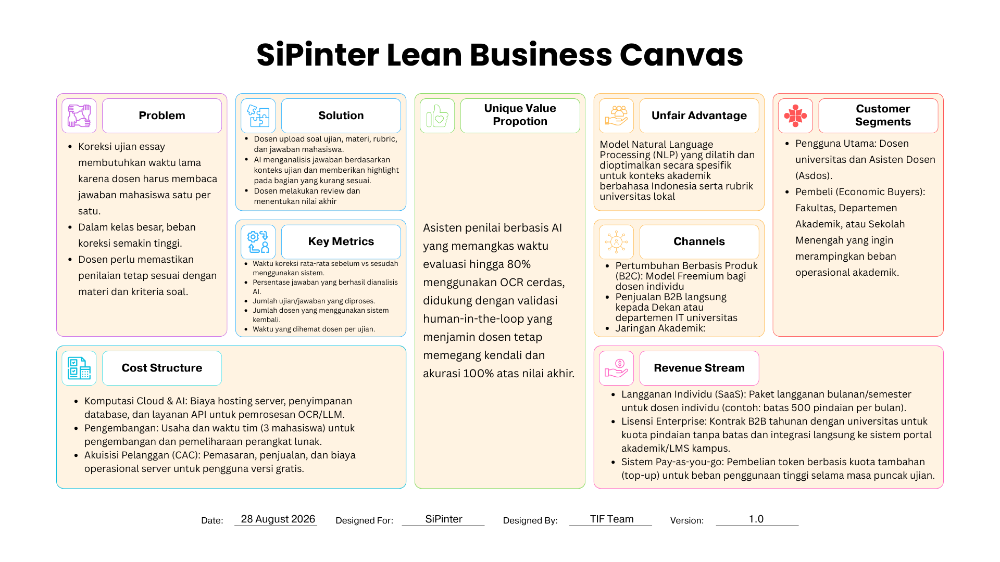

## Modul 1 – Pembentukan Kelompok & Perumusan Masalah

## LAB 1.1: PEMBENTUKAN KELOMPOK

Diskusikan dengan anggota dalam satu tim untuk menentukan peran dari setiap anggota, pembagian peran harus seimbang dengan mempertimbangkan kemampuan anggota.

| Nama | NIM | Peran |
| --- | --- | --- |
| Muhammad Fachry Alfareeza | 24/540199/TK/59922 | Project Manager & AI Engineer |
| Muhammad Ilkham Abdillah | 24/537977/TK/59653 | Cloud Engineer |
| Monica Anastasya Dantina | 24/544527/TK/60525 | Software Engineer & UI/UX |

## LAB 1.2: PERUMUSAN PERMASALAHAN

## a. Nama Kelompok

TIF Team

## b. Nama Produk

Nama Produk:

SiPinter

## c. Permasalahan yang dipecahkan

Latar Belakang:

Setiap periode Ujian Tengah Semester (UTS) dan Ujian Akhir Semester (UAS), dosen beserta asisten dosen (asdos) menghadapi beban kerja yang sangat tinggi dalam

memproses koreksi hasil ujian mahasiswa. Proses evaluasi konvensional mengharuskan mereka membaca ratusan lembar jawaban secara manual. Membaca tulisan dan format kalimat yang serupa dalam jangka waktu yang panjang memicu kelelahan visual dan kognitif. Kejenuhan operasional ini merupakan masalah yang signifikan karena berpotensi besar menurunkan tingkat ketelitian, efektivitas, serta efisiensi pengoreksi dalam mengevaluasi hasil kerja mahasiswa secara objektif.

Di sisi lain, perkembangan infrastruktur komputasi awan, Optical Character Recognition (OCR), dan model Kecerdasan Buatan (AI) menawarkan penyelesaian masalah yang belum dimanfaatkan secara maksimal dalam administrasi akademik konvensional. Ekstraksi teks dari input file PDF berupa lembar soal, lembar kunci jawaban, dan lembar kerja siswa kini dapat didigitalkan secara instan. Penggunaan AI memungkinkan pencocokan jawaban pilihan ganda secara otomatis dan pendeteksian jawaban esai untuk diekstraksi berdasarkan kata kunci yang relevan. Oleh karena itu, diperlukan pengembangan sebuah aplikasi web terintegrasi yang memudahkan pengoreksi mengevaluasi hasil kerja mahasiswa. Aplikasi ini mengadopsi pendekatan human-in-the- loop, di mana sistem melakukan screening isi file untuk mendeteksi jawaban, namun tetap menyediakan antarmuka bagi pengguna untuk mengonfirmasi dan mengoreksi

hasil screening yang salah sebelum data skor final divalidasi dan disimpan ke database.

Rumusan Permasalahan:

- Bagaimana merancang arsitektur aplikasi web yang mampu memproses dan mengekstraksi input file PDF (lembar soal, kunci jawaban, dan lembar kerja siswa) menggunakan teknologi OCR secara akurat?

- Bagaimana mengintegrasikan model Kecerdasan Buatan (AI) untuk melakukan screening terhadap jawaban pilihan ganda dan esai guna mendapatkan data jawaban serta kata kunci yang relevan dengan kunci jawaban standar?

- Bagaimana merancang antarmuka interaktif yang memfasilitasi proses cek hasil screening, sehingga pengguna dapat secara langsung mengoreksi kesalahan pembacaan sistem sebelum data disimpan ke dalam database?

- Bagaimana mengimplementasikan sistem Identity and Access Management (IAM) yang aman untuk mengautentikasi pengguna dan memberikan tingkat akses fungsi yang berbeda antara dosen dan asisten dosen?

Daftar Pustaka:

- [1] A. R. Lubis, F. Fitriyanti, et al., "Automated Short-Answer Grading using Semantic Similarity based on Word Embedding," International Journal of Technology, vol. 12, no. 3, p. 571, Jul. 2021, doi: 10.14716/ijtech.v12i3.4651.

- [2] S. N. Srihari, J. Collins, R. Srihari, H. Srinivasan, S. Shetty, and J. Brutt-Griffler, "Automatic scoring of short handwritten essays in reading comprehension tests," Artificial Intelligence, vol. 172, no. 2-3, pp. 300-324, 2008.

- [3] "Automatic scoring of English essays using OCR text recognition and a Bidirectional Long Short-Term Memory neural network," Proceedings of SPIE, vol. 14138, May 2026, doi: 10.1117/12.3108595.

- [4] "Transformer-Based Automated Essay Scoring with Attention Pooling and Multi-Task Learning for Analytic and Holistic Assessment," Global Scientific Journal, 2026.

- [5] "Hybrid Semantic–Syntactic NLP Framework for Intelligent Grading of Student Responses," Applied Sciences, vol. 16, no. 7, p. 3191, 2026.

## d. Ide solusi yang diusulkan beserta rancangan fitur

## Solusi:

Mengembangkan aplikasi web berbasis awan (cloud) yang memanfaatkan teknologi Optical Character Recognition (OCR) dan Kecerdasan Buatan (AI) untuk mengotomatisasi proses ekstraksi, evaluasi, dan penilaian hasil ujian mahasiswa. Sistem ini dirancang menggunakan pendekatan human-in-the-loop, di mana AI bekerja untuk mempercepat identifikasi dan koreksi, sementara dosen serta asisten dosen tetap memiliki kontrol penuh untuk memvalidasi (cek silang) hasil ekstraksi tersebut guna memastikan akurasi, efisiensi, dan objektivitas penilaian.

## Rancangan Fitur Solusi:

| Fitur | Keterangan |
| --- | --- |
| Input File | Memfasilitasi pengguna untuk mengunggah dokumen berformat PDF, yang meliputi lembar soal, lembar kunci jawaban standar, dan lembar kerja mahasiswa secara massal. |
| Pemindaian & Ekstraksi Cerdas | Memanfaatkan teknologi OCR dan AI untuk memindai isi dokumen, mengidentifikasi format jawaban pilihan ganda serta esai, lalu mengekstraksi data teks, soal, jawaban, dan kata kunci relevan untuk ditampilkan kepada pengguna.
| Validasi Hasil Screening | Menampilkan antarmuka perbandingan (dokumen asli vs hasil teks). Pengguna diwajibkan melakukan konfirmasi (human-in-the-loop). Jika terdapat kesalahan pembacaan sistem, pengguna dapat langsung mengoreksi dan mengedit teks atau pilihan ganda sebelum masuk ke tahap penilaian. |
| Penyimpanan pada Database | Secara otomatis menyimpan semua data soal, kunci jawaban, dan jawaban mahasiswa yang telah divalidasi ke dalam database sistem yang aman untuk diproses pada tahap selanjutnya. |
| Koreksi & Penilaian Otomatis | Pilihan Ganda: Sistem secara eksak mencocokkan jawaban mahasiswa dengan kunci jawaban (logika benar/salah mutlak). Esai: Sistem menggunakan Natural Language Processing (NLP) untuk menganalisis kemiripan semantik dan keberadaan kata kunci antara jawaban mahasiswa dengan kunci jawaban, lalu memberikan estimasi skor dalam rentang interval tertentu (misalnya, dari 0 hingga nilai maksimal). |
| Ekspor Laporan Evaluasi | Setelah seluruh proses koreksi selesai dan diverifikasi, pengguna dapat langsung mengunduh rekapitulasi nilai akhir mahasiswa dalam format spreadsheet untuk mempermudah integrasi dengan portal akademik kampus. |

## e. Analisis Kompetitor (Minimal 3 Kompetitor)

|   | KOMPETITOR 1 |   |
| --- | --- | --- |
| Nama | Gradescope (by Turnitin) |   |
| Jenis Kompetitor | Direct Competitor |   |
| Jenis Produk | Web Application (SaaS) |   |
| Target Customer | Dosen, asisten pengajar, dan institusi perguruan tinggi serta sekolah menengah |

| Kelebihan | Kekurangan |
| --- | --- |
| - Integrasi dengan LMS (canvas, blackboard, moodle) | - Biaya lisensi institusional mahal | 
| - Konfigurasi awal rumit | - Fitur pengelompokan jawaban serupa dengan AI |
| - NLP esai berbahasa Indonesia terbatas. | - Mendukung pemindaian tugas esai dan Pemrograman |

## Key Competitive Advantage & Unique Value

Integrasi LMS berskala global dan kemampuan AI-assisted grouping yang memproses penilaian batch berbasis rubrik terstandarisasi institusi.

|   | KOMPETITOR 2 |   |
| --- | --- | --- |
| Nama | ZipGrade |   |
| Jenis Kompetitor | Indirect Competitor |   |
| Jenis Produk | Mobile Application (Android/iOS) terintegrasi dengan Web Portal Cloud|
| Target Customer | Guru K-12, dosen, dan instruktur kursus yang membutuhkan evaluasi ujian cepat. |

| Kelebihan | Kekurangan |
| --- | --- |
| - cepat memindai lembar jawaban fisik menggunakan kamera ponsel kuota terbatas | - Hanya mendukung soal pilihan ganda berbasis Lembar Jawab Komputer (LJK) khusus |
| - biaya langganan murah/gratis untuk | 

## Key Competitive Advantage & Unique Value

Pemindaian OMR (Optical Mark Recognition) real-time berbasis kamera smartphone dengan latensi mendekati instan dan biaya operasional yang sangat rendah.

|   | KOMPETITOR 3 |
| --- | --- |
| Nama | CoGrader |
| Jenis Kompetitor | Direct Competitor |
| Jenis Produk | Web Application & Integrasi Google Classroom |
| Target Customer | Guru dan pengajar yang fokus pada penilaian esai serta tugas penulisan berbasis rubrik. |

| Kelebihan | Kekurangan |
| --- | --- |
| - Analisis teks esai secara mendalam menggunakan LLM  | - Terbatas pada tugas esai teks digital |
| - Menghasilkan draf umpan balik kualitatif (feedback) yang dipersonalisasi untuk setiap sisw | - Minim dukungan bahasa Indonesia |

## Key Competitive Advantage & Unique Value

Generasi draf umpan balik naratif berbasis AI kontekstual yang otomatis disesuaikan dengan matriks rubrik penilaian pengajar.

## SiPinter Lean Business Canvas

